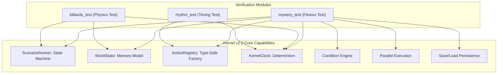

# Karakuri Architecture Contract v2.0

This document is a STRICT RULESET for AI development assistants working on the Karakuri Kernel. 
Violating these rules WILL break the kernel's determinism, safety, and architectural integrity.

---

## 1. SYSTEM OVERVIEW

Karakuri Game OS is structured as a STRICT multi-layered system.

- **Kernel Layer (`src/core/`)**: Pure C++ logic, state management, and orchestration.
- **Game Modules (`src/mystery/`, `src/invaders/`)**: Game-specific task implementations and data.
- **View Layer (GDScript / `.tscn`)**: UI presentation and input handling.

### DEPENDECY RULES
- **STRICT RULE**: Game Modules MUST depend on the Kernel.
- **STRICT RULE**: The View Layer MUST depend on the Kernel.
- **NEVER** allow the Kernel to depend on Game Modules or the View Layer.
- **NEVER** include `mystery/` headers inside `core/`.

---

## 2. MEMORY MODEL (WorldState)

`WorldState` is the SINGLE SOURCE OF TRUTH for all game data.

### STORAGE SCOPES
- **GLOBAL**: Persists across the entire application lifecycle.
- **SESSION**: Persists across a single playthrough/save file.
- **SCENE**: Persists only within the current scenario scene scope.

### STRICT RULES
- **NEVER** use local `godot::Dictionary` or static variables to store game state.
- **NEVER** store game logic state in Godot Nodes or Singleton Nodes.
- **ALWAYS** use `WorldState` for state persistence and retrieval.
- **ALWAYS** use the `state_changed` signal for observers to react to changes.

### Bad vs Good
❌ **Bad**
```cpp
Dictionary flags;
flags["door_open"] = true; // State is lost/unmanaged
```

⭕ **Good**
```cpp
WorldState::get_singleton()->set_bool(
    WorldState::SCOPE_SCENE,
    "door_open",
    true
); // Managed, deterministic, and observable
```

### WorldState Scope Decision Rules

| Scope | Lifetime | Usage Examples | Specific Game Data Examples |
| :--- | :--- | :--- | :--- |
| **GLOBAL** | Application | System settings, unlocks | `config:volume`, `user:unlocked_chapters` |
| **SESSION** | Current Play | Narrative progress, inventory | `mystery:evidence_list`, `story:current_flag_v3` |
| **SCENE** | Single Scene | Local puzzle state, temporary | `puzzle:key_inserted`, `interaction:npc_met_count` |

**RULE**: Default to `SESSION` for any data that should be part of a saved game. Use `SCENE` for "volatile" logic that should reset when leaving the area.

---

## 3. Namespace Rules

To maintain a clean Kernel, strict namespacing is enforced:

- **Kernel Core**: Use `namespace karakuri`. Reserved for `src/core/`.
- **Game Modules**: Use `namespace karakuri::games::<module_name>`.
    - Example: `karakuri::games::mystery_test`, `karakuri::games::billiards_test`.

**RULE**: AI must NEVER place game-specific classes or types directly into the root `karakuri` namespace.

---

## 3. TIME MODEL (KernelClock)

Karakuri uses a **Deterministic Runtime Clock**. Engine frame deltas are unreliable.

### STRICT RULES
- **NEVER** use Godot's `_process(double delta)` or `_physics_process` for game logic.
- **NEVER** perform time-based calculations using raw `delta` values.
- **ALWAYS** use `KernelClock::get_singleton()->now()` to get the current deterministic time.

### Bad vs Good
❌ **Bad**
```cpp
elapsed_ += delta;
if (elapsed_ > 3.0) {
    complete();
} // Not deterministic
```

⭕ **Good**
```cpp
if (KernelClock::get_singleton()->now() >= target_time_) {
    return TaskResult::Success;
} // Deterministic and repeatable
```

---

## 6. Scene Flow Rules

AI must distinguish between "Narrative Logic" and "Visual Presentation."

| Operation | Method / Signal | Component Responsibility |
| :--- | :--- | :--- |
| **Narrative Jump** | `load_scene_by_id(id)` | **ScenarioRunner**: Changes the YAML scenario label/pointer. |
| **Visual Transition** | `emit_signal("transition_requested")` | **View Layer**: Handles screen fades, asset loading, VFX. |
| **UI Navigation** | Custom Signal via Runner | **View Layer**: Opens menus, inventory, or overlays. |

### Allowed vs Forbidden
| Operation | Allowed in Task? | Recommended Method |
| :--- | :--- | :--- |
| Branching story flow | ✅ YES | `runner->load_scene_by_id("next_label")` |
| Loading a `.tscn` file | ❌ NO | `runner->emit_signal("transition_requested", "room_b")` |
| Screen Fade-out/in | ❌ NO | Handled by View via `transition_requested` |
| Logic-based Label Jump | ✅ YES | `runner->load_scene_by_id(target)` |

---

## 7. Signal Ownership Rules

Signals ARE the ABI of the Kernel. Their ownership must be centralized.

**CORE PRINCIPLE**: The `ScenarioRunner` is the central post office.

- **Centralized Ownership**: All externally significant signals (View inputs/outputs) MUST be defined and emitted from `ScenarioRunner`.
- **Task Role**: Tasks are **Signal Requesters**. They call the Runner API; they do not own the signals.
- **View Role**: The View Layer connects ONLY to the `ScenarioRunner`.

### Signal Responsibility Table
| Signal Name | Owner | Triggered By | Usage |
| :--- | :--- | :--- | :--- |
| `dialogue_requested` | `ScenarioRunner` | `ShowDialogueTask` | Display text on UI |
| `choice_requested` | `ScenarioRunner` | `ChoiceTask` | Show multiple options to user |
| `transition_requested`| `ScenarioRunner` | `TransitionTask` | Request screen/room change |
| `game_ended` | `ScenarioRunner` | `EndGameTask` | Show game over or credits |

**RULE**: AI must NEVER define UI-related signals inside a `Task` class. Use the `ScenarioRunner` as the proxy.

---

## 5. DATA MODEL (Typed Scenario IR)

Karakuri DOES NOT execute raw YAML/JSON at runtime. Data MUST be compiled into `TaskSpec`.

### STRICT RULES
- **NEVER** use dynamic property injection like `task->set("key", value)`.
- **NEVER** use `ADD_PROPERTY` for task-internal execution state.
- **ALWAYS** use `TaskSpec` for task construction and `validate_and_setup(const TaskSpec&)` for initialization.
- **STRICT RULE**: Tasks MUST treat `TaskSpec` as read-only IR.

### Bad vs Good
❌ **Bad**
```cpp
task->set("duration", 5.0); // Legacy dynamic injection
```

⭕ **Good**
```cpp
TaskSpec spec;
spec.action = "wait";
spec.payload["duration"] = 5.0;
registry->compile_task(spec); // Validated and compiled
```

---

## 6. ACTION FACTORY

Action registration MUST be type-safe.

### STRICT RULES
- **NEVER** use `ClassDB::instantiate` or string-to-class reflection for Task creation.
- **ALWAYS** use `ActionRegistry::register_action_class<T>(name)`.

### Bad vs Good
❌ **Bad**
```cpp
Object *obj = ClassDB::instantiate("WaitTask"); // Unsafe reflection
```

⭕ **Good**
```cpp
registry->register_action_class<WaitTask>("wait"); // Type-safe factory
```

---

## 7. VIEW / CORE SEPARATION

**Core is agnostic of the View.**

### STRICT RULES
- **NEVER** use `get_node()` to find UI elements from `src/core/`.
- **ALWAYS** communicate from Core to View via **signals**.
- **ALWAYS** communicate from View to Core via **method calls** on singletons.

### Bad vs Good
❌ **Bad**
```cpp
get_node("UI/Dialogue").call("show_text", text); // Hard coupling
```

⭕ **Good**
```cpp
emit_signal("dialogue_requested", speaker, text); // Decoupled
```

---

## 8. EXTENDING KARAKURI

To add new functionality to the Game OS:

### THE EXTENSION PROTOCOL
1. **CREATE** a new `Task` class inheriting from `TaskBase`.
2. **DEFINE** its `TaskSpec` structure (if applicable).
3. **IMPLEMENT** `validate_and_setup(const TaskSpec& spec)`.
4. **REGISTER** the class in `register_types.cpp` via `ActionRegistry`.

**STRICT RULE**: DO NOT modify `ScenarioRunner.cpp` to add new game-specific logic. Extend by adding Tasks.

---

## 10. KERNEL TEST MATRIX

The following matrix shows which game modules verify which core Kernel capabilities. This ensures full regression coverage for every Game OS update.



---

### mystery_test: Kernel Fitness Test

`mystery_test` is **not a sample game**. It is a formal Kernel Fitness Test for Karakuri v2.0.

Its sole purpose is to verify that a fully functional narrative game can be built using only:
- `Task` classes (no `src/core/` modifications)
- YAML scenario files
- `WorldState` (SESSION scope mutations)
- `ActionRegistry` (type-safe task registration)
- `ScenarioRunner` (state-machine execution)

This proves the Kernel extension model is complete and that game logic belongs exclusively in modules.

#### Coverage Table

| mystery_test capability | Kernel feature verified |
| --- | --- |
| `show_dialogue` | Signal handshake / `Waiting` state lifecycle |
| `discover_evidence` | `WorldState` SESSION mutation + duplicate guard |
| `check_condition` | Condition engine (all_of / any_of, compound branching) |
| `wait_for_signal` | `KernelClock` timeout safety (deadlock prevention) |
| `end_game` | External signal dispatch via `ScenarioRunner` |
| `mystery_stress_test.yaml` | ScenarioRunner large graph (50 dialogue / 30 condition / 20 evidence / 10 timeout nodes) |
| `mystery_timeout_test.yaml` | Timeout fallback path isolation |

#### Why This Matters

If `mystery_test` runs correctly end-to-end without touching `src/core/`, it demonstrates that the Kernel's
extension contract is sound. Any regression in `mystery_test` is a signal that a Kernel API has broken its
contract — not that the game logic is wrong.

---

## 11. FINAL WARNING
