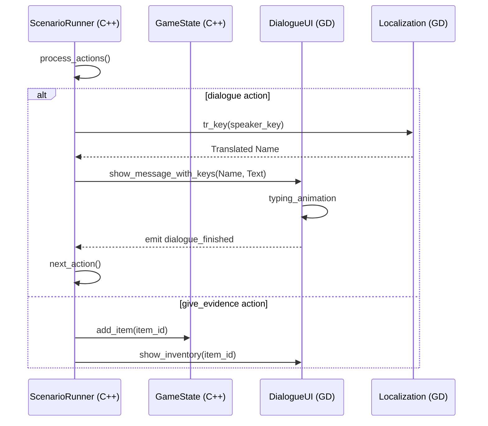
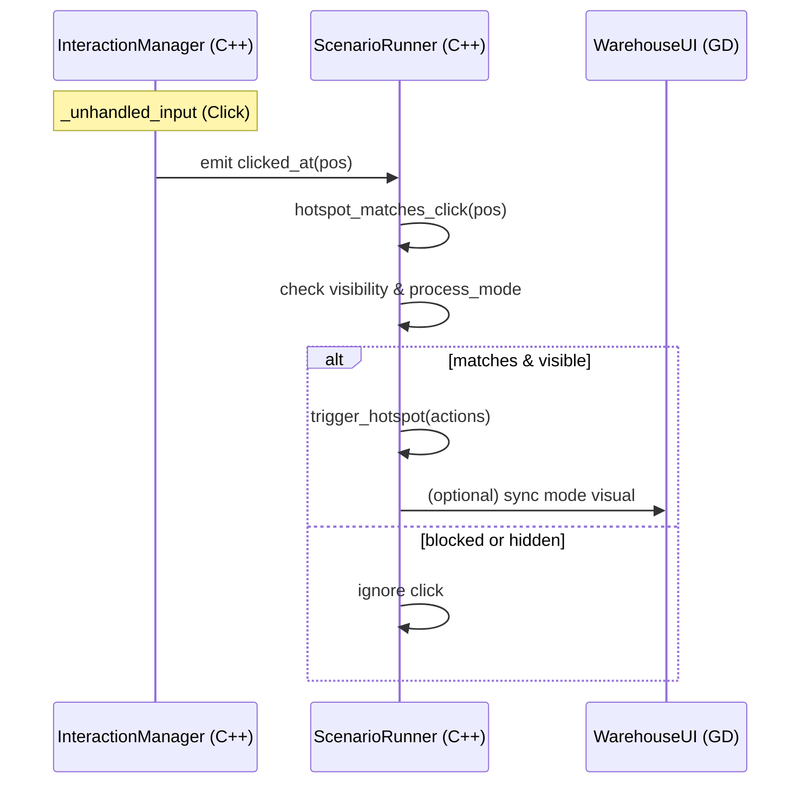
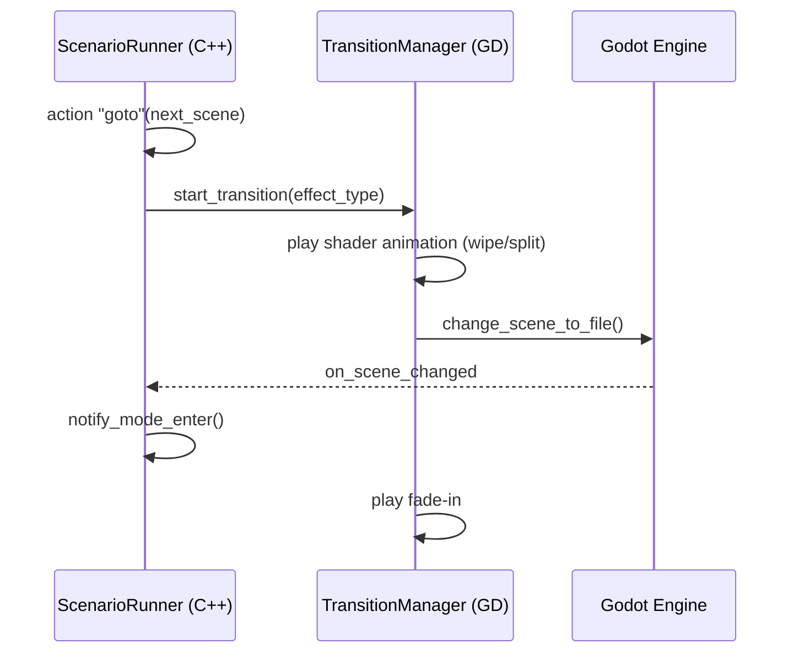

# データシーケンス (Data Sequence Design)

## 1. シナリオアクション実行シーケンス

```mermaid
sequenceDiagram
    participant S as ScenarioRunner (C++)
    participant G as GameState (C++)
    participant U as DialogueUI (GD)
    participant L as Localization (GD)

    S->>S: process_actions()
    alt dialogue action
        S->>L: tr_key(speaker_key)
        L-->>S: Translated Name
        S->>U: show_message_with_keys(Name, Text)
        U->>U: typing_animation
        U-->>S: emit dialogue_finished
        S->>S: next_action()
    else give_evidence action
        S->>G: add_item(item_id)
        S->>U: show_inventory(item_id)
    end
```

## 2. ホットスポット・インタラクションシーケンス

```mermaid
sequenceDiagram
    participant I as InteractionManager (C++)
    participant S as ScenarioRunner (C++)
    participant W as WarehouseUI (GD)

    Note over I: _unhandled_input (Click)
    I->>S: emit clicked_at(pos)
    S->>S: hotspot_matches_click(pos)
    S->>S: check visibility & process_mode
    alt matches & visible
        S->>S: trigger_hotspot(actions)
        S->>W: (optional) sync mode visual
    else blocked or hidden
        S->>S: ignore click
    end
```

## 3. シーン移行シーケンス

```mermaid
sequenceDiagram
    participant S as ScenarioRunner (C++)
    participant T as TransitionManager (GD)
    participant G as Godot Engine

    S->>S: action "goto"(next_scene)
    S->>T: start_transition(effect_type)
    T->>T: play shader animation (wipe/split)
    T->>G: change_scene_to_file()
    G-->>S: on_scene_changed
    S->>S: notify_mode_enter()
    T->>T: play fade-in
```
