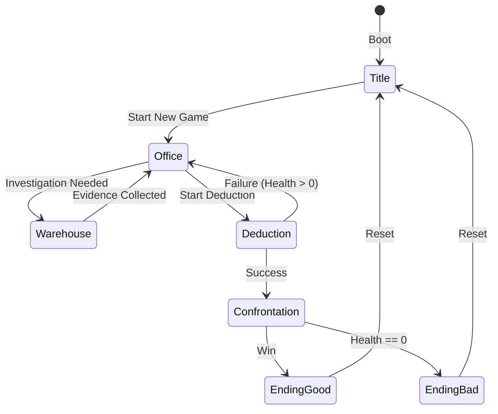
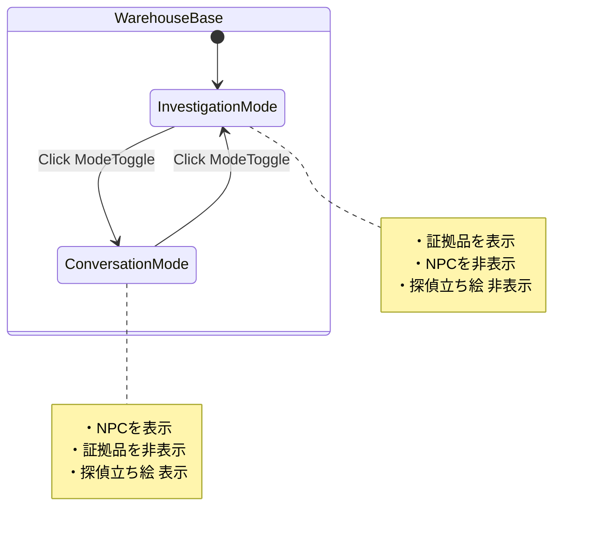
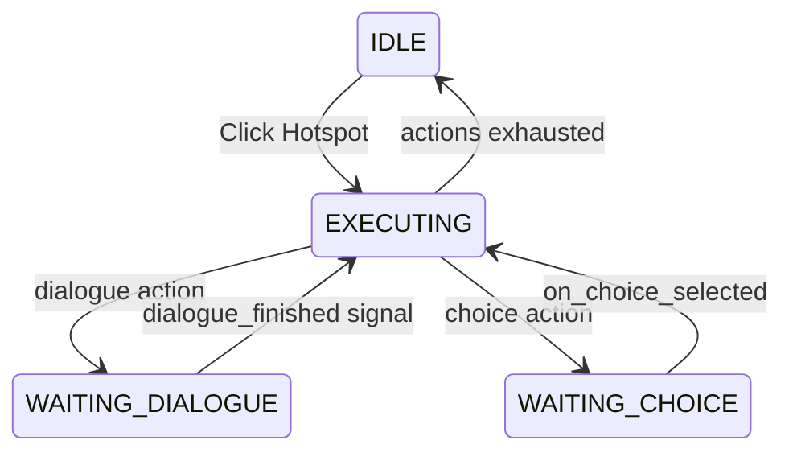

# 状態遷移図 (State Transition Design)

## 1. ゲーム全体の状態遷移

```mermaid
stateDiagram-v2
    [*] --> Title: Boot
    Title --> Office: Start New Game
    Office --> Warehouse: Investigation Needed
    Warehouse --> Office: Evidence Collected
    Office --> Deduction: Start Deduction
    Deduction --> Office: Failure (Health > 0)
    Deduction --> Confrontation: Success
    Confrontation --> EndingGood: Win
    Confrontation --> EndingBad: Health == 0
    EndingGood --> Title: Reset
    EndingBad --> Title: Reset
```

## 2. 倉庫シーン内インタラクションモード遷移

```mermaid
stateDiagram-v2
    state WarehouseBase {
        [*] --> InvestigationMode
        InvestigationMode --> ConversationMode: Click ModeToggle
        ConversationMode --> InvestigationMode: Click ModeToggle
        
        note right of InvestigationMode: ・証拠品を表示<br/>・NPCを非表示<br/>・探偵立ち絵 非表示
        note right of ConversationMode: ・NPCを表示<br/>・証拠品を非表示<br/>・探偵立ち絵 表示
    }
```

## 3. ダイアログ・シナリオ実行状態遷移

```mermaid
stateDiagram-v2
    IDLE --> EXECUTING: Click Hotspot
    EXECUTING --> WAITING_DIALOGUE: dialogue action
    WAITING_DIALOGUE --> EXECUTING: dialogue_finished signal
    EXECUTING --> WAITING_CHOICE: choice action
    WAITING_CHOICE --> EXECUTING: on_choice_selected
    EXECUTING --> IDLE: actions exhausted
```
