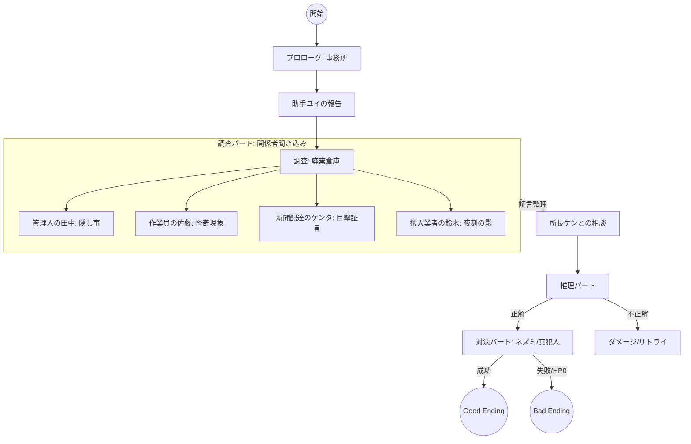

# ストーリー・フラグ設計 (Story & Scenario Design)

## 1. シナリオ構成

### Mermaid フロー

## 2. 登場人物設計 (Characters)

| キャラクターID | 役割 | 属性・立ち絵配置 |
|---|---|---|
| `ren` | 主人公 / 探偵 | 左 (Left) |
| `ken` | ボス / 所長 | 右 (Right) |
| `yui` | 助手 | 右 (Right) |
| `tanaka` | 倉庫管理人 | 右 (Right) |
| `sato` | 倉庫作業員 | 右 (Right) |
| `kenta` | 新聞配達員 | 右 (Right) |
| `suzuki` | 搬入業者 | 右 (Right) |
| `rat_witness` | 犯人? / ネズミ | 右 (Right) |

## 3. フラグ管理 (Flags)

| フラグID | 初期値 | 設定トリガー | 用途 |
|---|---|---|---|
| `talked_to_tanaka` | false | 田中との初会話終了 | 足跡の調査を可能にするための前提条件 |
| `found_footprint` | false | 足跡クリック成功 | 推理・対決パートの進行条件 |
| `found_ecto` | false | 佐藤との会話/エクト入手 | 推理・対決パートの進行条件 |
| `health` | 3 | ゲーム開始時 | 失敗許容回数。0になると強制的にBad End |

## 4. 証拠品データ (Evidence Items)

| アイテムID | 名称 | 入手方法 | 突きつけ効果 |
|---|---|---|---|
| `ectoplasm` | エクトプラズム | 倉庫作業員から入手 | 犯人の非科学的な主張を論破 |
| `footprint` | 足跡 | 倉庫床の調査で入手 | 管理人の「清掃済み」発言と矛盾 |
| `torn_memo` | 引き裂かれたメモ | 鈴木から入手 | 事件現場周辺の状況整理 |
| `witness_report` | 目撃証言書 | ケンタから入手 | 時系列の矛盾を指摘 |
