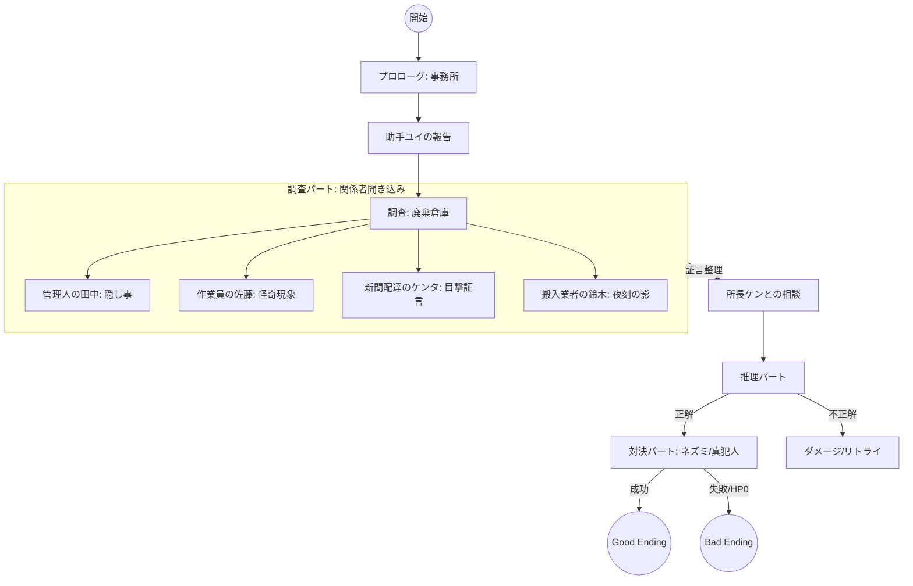

# Mystery Scenario Master Plan (シナリオ全体設計書)

本ドキュメントは、ミステリーデモのシナリオにおける論理構造、フラグ管理、および進行条件を網羅的に定義する。
テンプレートとしての汎用性と、ゲームとしての完成度を担保するためのマスターデータとする。

## 1. シナリオ構造概略 (Mermaid Flow)

## 2. フラグ & パラメータ定義

### 2.1 進行フラグ (Flags)
| フラグ名 | 型 | 用途 |
|---|---|---|
| `found_footprint` | bool | 足跡を調査済みか |
| `found_ecto` | bool | エクトプラズムを調査済みか |
| `game_over` | bool | HP0によるゲームオーバー判定 |

### 2.2 登場人物 & 証言役割 (Character Roles)
| キャラクターID | 役割 | 主な証言・提供証拠 |
|---|---|---|
| `ren` | 主人公 | プレイヤーの化身。思考モノローグ。 |
| `yui` | 助手 | 事件の端緒報告、ログ管理。 |
| `ken` | ボス | 推理のヒント、バックアップ。 |
| `tanaka` | 倉庫管理人 | 「足跡」の矛盾（清掃済みのはずだが...）。 |
| `sato` | 作業員 | 「エクトプラズム」についての噂。 |
| `kenta` | 新聞配達 | 「夜間の影」についての不審な目撃。 |
| `suzuki` | 搬入業者 | 「引き裂かれたメモ」の拾得場所の特定。 |

### 2.3 プレイヤーリソース
| パラメータ | 初期値 | 増減条件 | 影響 |
|---|---|---|---|
| `health` (HP) | 3 | 推理ミス、対決失敗 | 0になると `EndBad` へ強制遷移 |

## 3. シーン遷移仕様

### 3.1 調査パート (Investigation)
- **場所**: `res://samples/mystery/warehouse_base.tscn`
- **完了条件**: 3つの証拠（足跡、エクト、メモ）をすべて所持していること。
- **出口判定**: `InteractionManager` 経由で `hs_exit` をクリックした際に、`if_has_items` で判定する。

### 3.2 推理パート (Deduction)
- **場所**: `res://samples/mystery/office_base.tscn`
- **論理構成**:
  - 正解アクション: 「幽霊」を選択。
  - 失敗ペナルティ: `take_damage: 1`。HPが残っていれば `goto: deduction` でループ。

### 3.3 対決パート (Confrontation)
- **場所**: `res://samples/mystery/warehouse_base.tscn`
- **対話相手**: ネズミの目撃者 (`rat_witness`)
- **証言構造**:
  - 証言1: 揺さぶり可能。
  - 証言2: `footprint` を突きつけることで突破。
  - 証言3: `torn_memo` を突きつけることで突破。
- **勝利条件**: 指定ラウンド内にすべての矛盾を暴く (`on_success`)。

## 4. 演出ガイドライン (YAML定義)
- **トランジション**: 
  - 心理的な切り替え（推理開始など）には `cross_fade`。
  - 物理的な移動には `wipe` または `split`。
  - 結末への移行には `page_turn` を推奨。
- **バストアップ**:
  - 主人公: `left` 固定。
  - 対面者: `right` 固定。
  - 緊迫した場面: `center` または `zoom_flip` を活用。

## 6. システム & UI 操作仕様

### 6.1 倉庫シーンのデュアルモード制御
倉庫シーンでは、`WarehouseMode` によるモード切り替えを導入している。

- **調査モード (INVESTIGATE)**:
  - 証拠品ビジュアルを表示。
  - NPCノードを非表示にし、当たり判定（hotspot interaction）を無効化。
  - プレイヤー（探偵）の立ち絵を非表示にし、背景の視認性を確保。
- **会話モード (TALK)**:
  - NPCノードを表示し、当たり判定を有効化。
  - 証拠品ビジュアルおよび当たり判定を無効化。

### 6.2 入力ブロッキング仕様
誤操作防止のため、以下の入力制御を実装している。

1.  **UI背面透過防止**:
    - `InteractionManager` は `_unhandled_input` を使用。UI（インベントリ、ダイアログ等）がイベントを消費した場合はワールドに到達しない。
2.  **インベントリ表示中の制御**:
    - インベントリが開いている間、C++層の `KarakuriScenarioRunner` はホットスポットのクリック判定をスキップする。
3.  **可視性ベースの制御**:
    - `is_visible_in_tree()` が `false` のホットスポットはクリックを検知しない。
4.  **立ち絵のマウスフィルター**:
    - `PortraitContainer` および `PortraitRect` は `mouse_filter: IGNORE` に設定。立ち絵が重なっている背後のオブジェクトも問題なくクリック可能。

---
最終更新: 2026-02-25
